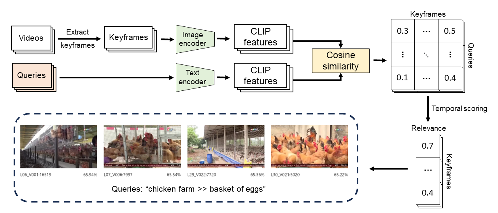

# TOMS video retrieval engine

A video retrieval engine based on CLIP and Temporal Ordered Multi-query
Scoring.



This engine is used at [HCMC AI-Challenge
2023](https://aichallenge.hochiminhcity.gov.vn/) and got first place in the
high school division.

To learn more about the engine, you can read our paper: <https://dl.acm.org/doi/10.1145/3628797.3628984>.

## Dataset

[Example
dataset](https://docs.google.com/spreadsheets/d/1nnfmpsIB2Cm0jatlN10WjwwZvEIvQxctf8_8YKQfXi4/edit#gid=0)
used in the elimination round of HCMC AI-Challenge 2023.

The retrieval engine needs a dataset in the following format

```
dataset/
    clip-features-vit-b32/
        video1.npy
        video2.npy
        ...
    map-keyframes/
        video1.csv
        video2.csv
        ...
    metadata/
        video1.json
        video2.json
        ...

downscaled/
    video1/
        0001.jpg
        0002.jpg
        ...
    video2/
        0001.jpg
        0002.jpg
        ...
    ...
```

`clip-features-vit-b32/video.npy` is a 2d tensor representing the every
keyframes of the video encoded with OpenAI's CLIP ViT-B/32 Model.

`map-keyframes/video.csv` is a table of all keyframes in this format:

| n   | pts_time   | fps | frame_idx          |
| --- | ---------- | --- | ------------------ |
| 1   | timestamp1 | fps | = timestamp1 * fps |
| 1   | timestamp2 | fps | = timestamp2 * fps |
| ... | ...        | ... | ...                |

`metadata/video.json` is a JSON object of the video's metadata. We only
requires the field `watch_url` for the engine to work.

## Installation

Create a Python virtual environment, we tested with Python 3.11.

Clone the repository

```sh
git clone https://github.com/ziap/toms-retrieval
cd toms-retrieval
```

Install [PyTorch](https://pytorch.org/get-started/locally/) for your platform
and hardware, we used version 2.0.1.

Install other dependencies

```sh
pip install ftfy regex tqdm
pip install git+https://github.com/openai/CLIP.git
pip install starlette "uvicorn[standard]"
```

## Submission server configuration

You can config the submission backend and credential. The engine assumes the
submission backend uses [DRES](https://github.com/dres-dev/DRES). You can still
use the rest of the engine without the submission functionality on other
backends.

```json
{
  "api_url": "<dres_server_url>",
  "username": "<username>",
  "password": "<password>"
}
```

## Running

Start the server

```sh
python main.py
```

Then access the engine at `http://localhost:8000`

## License

This work is licensed under the [MIT License](LICENSE).

If this project is useful for your research, please cite the following paper:

```bibtex
@inproceedings{10.1145/3628797.3628984,
  author = {Bui, Huy-Giap and Trinh, Minh-Huy and Le, Canh-Toan and Vu, Quoc-Lam and Vo, Khac-Trieu},
  title = {Zero-Shot Video Retrieval Using CLIP with Temporally Ordered Multi-Query Scoring},
  year = {2023},
  booktitle = {Proceedings of the 12th International Symposium on Information and Communication Technology},
  pages = {938–944},
  numpages = {7},
  series = {SOICT '23}
}
```
